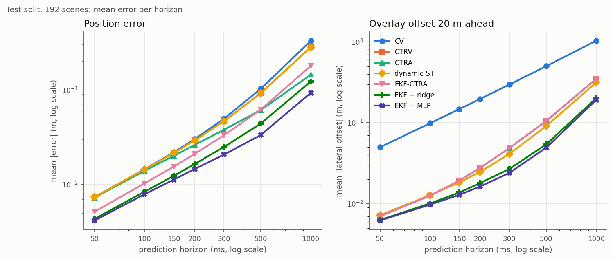
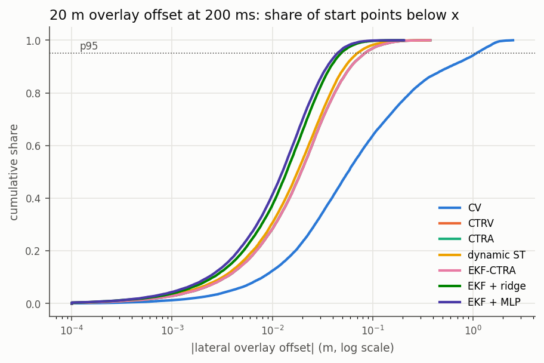
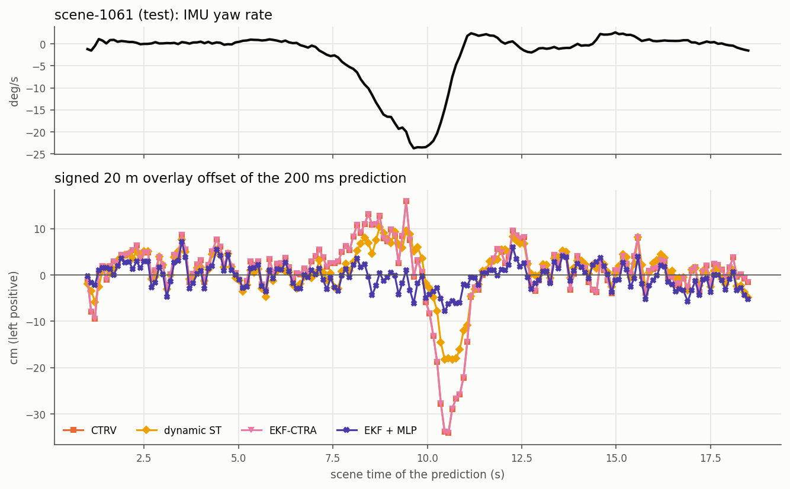
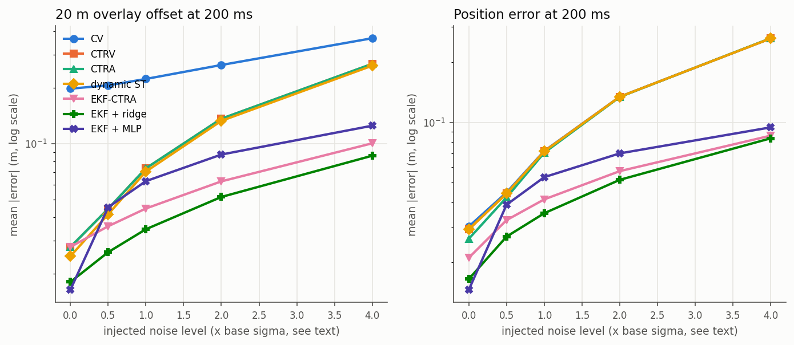
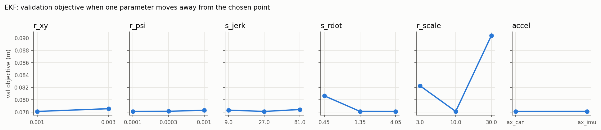
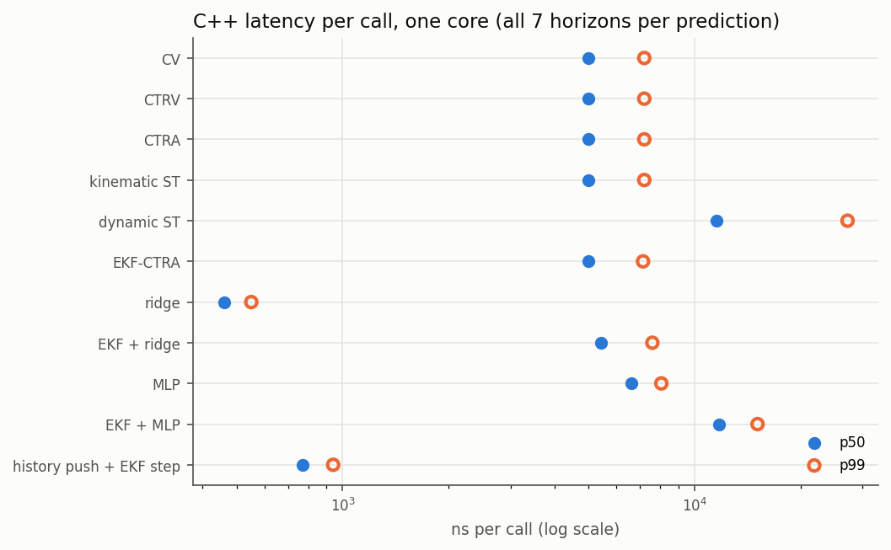

# Ego motion prediction for AR-HUD latency compensation

Generated by `scripts/reproduce_mpred.py` on 2026-10-09 at commit `c46f723adfda`. Do not edit by hand. Host: AMD EPYC 7R13 Processor, 32 logical CPUs; C++ built with `bazel build -c opt` (gcc (GCC) 11.5.0 20240719 (Red Hat 11.5.0-5)). Data: nuScenes CAN bus expansion (CC BY-NC-SA 4.0), two Renault Zoe cars (n008 Boston, n015 Singapore).

## The question

An augmented-reality head-up display draws contact-analog overlays (a navigation arrow on the lane, a marker on the car ahead) at a fixed place in the world. Between the newest sensor sample and the moment the frame is lit there is a latency (sensor transport, fusion, rendering, display scan-out), so the overlay must be drawn for where the car will be at display time, not where it was. This module compares ways to predict the ego pose (x, y, yaw) and speed 50, 100, 150, 200, 300 and 500 ms ahead (1 s for context) from what a function on the car has at the prediction instant: the recent localization poses, the wheel speed, the IMU yaw rate and acceleration and the steering angle.

Errors are measured against the recorded pose at the display time. Besides the position error the table columns that matter for a HUD are the **heading error** and the **overlay offset**: an overlay placed D metres ahead along the predicted heading lands beside its target by exactly `lateral error + D sin(heading error)` (lateral in the true vehicle frame; `tools/mpred/metrics.py`). At D = 20 m a heading error of 0.1 deg alone moves the overlay by 3.5 cm, so heading dominates at look-ahead distances and position dominates near the car. The angular error seen from the reference point is atan(|offset| / D). The reference point is the middle of the rear axle (the nuScenes ego origin); the driver's eye is about a metre further forward, which changes D slightly, not the comparison.

## Data, split and causality

| split | scenes | hours | pose samples | start points | start-point stride |
|---|---|---|---|---|---|
| train | 604 | 3.27 | 586,324 | 209,215 | every 2 samples |
| val | 183 | 0.99 | 177,981 | 23,637 | every 5 samples |
| test | 192 | 1.04 | 186,386 | 27,715 | every 5 samples |

- All 979 scenes of the v0.3.0 CAN set (5.31 h, 950,691 pose samples at about 49 Hz), with the same fixed split (`configs/vdyn/split.json`: whole logs, stratified by car, seed 20261007). Fitting uses train only, every choice (filter noise, ridge strength, network size, acceleration source) is made on validation, and every number below is on test unless it says otherwise.
- `tools/mpred/extract.py` writes a second table set (`can_scenes_v2`, outside git) with the same scenes and pose rows as v0.3.0 (the extractor checks this), but every CAN and IMU signal is the latest message received at or before the pose time (sample and hold). The v0.3.0 tables interpolate linearly, which reads up to 10 ms into the future: fine for identification, a leak for a prediction benchmark. The v0.3.0 tables and results are unchanged.
- A start point is a pose sample with at least 50 samples (about 1 s) of history, the drive gear from the start until 1.2 s later, and at least 1.0 m/s wheel speed. Predictions read samples up to the start sample only; a unit test perturbs every later sample and checks that no prediction changes (`tools/mpred/tests/test_causality.py`). The truth at t + h is the recorded pose, interpolated linearly between the two neighbouring pose samples.
- Statistics: 95 % percentile bootstrap intervals over scenes (2,000 resamples, scenes are the unit; samples within a scene are strongly correlated), as in v0.3.0. Paired comparisons use the same resamples for both methods. p95 values are pooled over start points, without an interval.

## Methods

| key | method | family | inputs at the start sample | parameters |
|---|---|---|---|---|
| `cv` | CV (constant velocity) | kinematic model | pose, wheel speed | none |
| `ctrv` | CTRV (constant turn rate and velocity) | kinematic model | pose, wheel speed, IMU yaw rate | none |
| `ctra` | CTRA (constant turn rate and acceleration) | kinematic model | + acceleration | acceleration source (val) |
| `kinematic` | kinematic single track, inputs held | kinematic model | pose, wheel speed, steering | v0.3.0 identification |
| `dynamic` | linear dynamic single track, inputs held | dynamic model | pose, wheel speed, steering, IMU yaw rate | v0.3.0 identification |
| `kf_cv` | KF-CV (linear Kalman, pose position only) | Kalman filter | pose position | q, r (val grid) |
| `kf_ca` | KF-CA (linear Kalman, pose position only) | Kalman filter | pose position | q, r (val grid) |
| `ekf` | EKF-CTRA (pose + wheel speed + IMU yaw rate + accel) | Kalman filter | pose, wheel speed, IMU yaw rate, accel | 6 values (val grid) |
| `ridge` | ridge regression on physical features | regression | signals at lags 0/5/25 (18 features) | weights (train), lambda (val) |
| `mlp` | MLP on the raw history window | data-driven | 33 raw history values | weights (train), size (val) |
| `hybrid_ridge` | hybrid: EKF-CTRA + ridge residual | hybrid | EKF state + 18 features | EKF (val) + weights (train), lambda (val) |
| `hybrid_mlp` | hybrid: EKF-CTRA + MLP residual | hybrid | EKF state + 33 raw history values | EKF (val) + weights (train), size (val) |

All physics predictors share one kernel: (x, y, yaw, v) with acceleration and yaw rate held, classical RK4 with 10 ms steps, the speed clamped at zero (the clamp came from a failing C++ unit test: an RK4 step that brakes through zero left -0.01 m/s). The filters run causally over every sample of a scene from its first sample; predictions start from the filtered state. The learned models predict all 7 horizons x (dx, dy, dyaw, dv) at once (28 outputs): `ridge` and `mlp` directly in the frame of the newest pose, the hybrids as a correction of the EKF-CTRA forecast. The dynamic and kinematic single-track models use the v0.3.0 parameters (`configs/vdyn/renault_zoe.json`) unchanged. Not done: a UKF (the measurement model is linear, so a UKF would differ from the EKF only in the 20 ms prediction step) and recurrent networks.

## 1. Accuracy on the test split

**Position error (m)**, mean [95 % CI] and pooled p95:

| method | 100 ms | 200 ms | 500 ms | p95 100 ms | p95 200 ms | p95 500 ms |
|---|---|---|---|---|---|---|
| CV (constant velocity) | 0.0146 [0.0141, 0.0151] | 0.0302 [0.0292, 0.0313] | 0.1026 [0.0979, 0.1073] | 0.0321 | 0.0646 | 0.2257 |
| CTRV (constant turn rate and velocity) | 0.0145 [0.0140, 0.0150] | 0.0293 [0.0283, 0.0304] | 0.0925 [0.0884, 0.0966] | 0.0320 | 0.0641 | 0.2071 |
| CTRA (constant turn rate and acceleration) | 0.0140 [0.0135, 0.0145] | 0.0263 [0.0253, 0.0273] | 0.0614 [0.0588, 0.0642] | 0.0310 | 0.0567 | 0.1283 |
| kinematic single track, inputs held | 0.0145 [0.0140, 0.0150] | 0.0293 [0.0282, 0.0304] | 0.0922 [0.0881, 0.0963] | 0.0320 | 0.0641 | 0.2069 |
| linear dynamic single track, inputs held | 0.0145 [0.0140, 0.0150] | 0.0293 [0.0282, 0.0304] | 0.0923 [0.0882, 0.0964] | 0.0321 | 0.0641 | 0.2067 |
| KF-CV (linear Kalman, pose position only) | 0.0108 [0.0106, 0.0110] | 0.0261 [0.0256, 0.0267] | 0.1018 [0.0982, 0.1055] | 0.0258 | 0.0598 | 0.2368 |
| KF-CA (linear Kalman, pose position only) | 0.0152 [0.0149, 0.0157] | 0.0300 [0.0292, 0.0308] | 0.0992 [0.0967, 0.1018] | 0.0374 | 0.0734 | 0.2387 |
| EKF-CTRA (pose + wheel speed + IMU yaw rate + accel) | 0.0103 [0.0101, 0.0106] | 0.0211 [0.0205, 0.0218] | 0.0621 [0.0593, 0.0650] | 0.0223 | 0.0456 | 0.1404 |
| ridge regression on physical features | 0.0097 [0.0095, 0.0099] | 0.0169 [0.0164, 0.0173] | 0.0360 [0.0350, 0.0371] | 0.0235 | 0.0408 | 0.0868 |
| MLP on the raw history window | 0.0094 [0.0092, 0.0097] | 0.0171 [0.0167, 0.0175] | 0.0388 [0.0378, 0.0397] | 0.0233 | 0.0423 | 0.0952 |
| hybrid: EKF-CTRA + ridge residual | 0.0085 [0.0083, 0.0087] | 0.0165 [0.0161, 0.0170] | 0.0442 [0.0431, 0.0452] | 0.0202 | 0.0397 | 0.1057 |
| hybrid: EKF-CTRA + MLP residual | 0.0079 [0.0078, 0.0081] | 0.0146 [0.0143, 0.0150] | 0.0334 [0.0325, 0.0343] | 0.0194 | 0.0354 | 0.0819 |

**Heading error (deg)**, mean [95 % CI] and pooled p95:

| method | 100 ms | 200 ms | 500 ms | p95 100 ms | p95 200 ms | p95 500 ms |
|---|---|---|---|---|---|---|
| CV (constant velocity) | 0.279 [0.243, 0.316] | 0.552 [0.479, 0.626] | 1.362 [1.179, 1.547] | 1.510 | 3.038 | 7.586 |
| CTRV (constant turn rate and velocity) | 0.031 [0.030, 0.032] | 0.070 [0.066, 0.074] | 0.273 [0.249, 0.299] | 0.088 | 0.223 | 1.078 |
| CTRA (constant turn rate and acceleration) | 0.031 [0.030, 0.032] | 0.070 [0.066, 0.074] | 0.273 [0.249, 0.299] | 0.088 | 0.223 | 1.078 |
| kinematic single track, inputs held | 0.040 [0.038, 0.042] | 0.072 [0.068, 0.077] | 0.252 [0.229, 0.274] | 0.114 | 0.213 | 0.961 |
| linear dynamic single track, inputs held | 0.032 [0.030, 0.033] | 0.062 [0.059, 0.066] | 0.238 [0.217, 0.260] | 0.089 | 0.180 | 0.908 |
| KF-CV (linear Kalman, pose position only) | 0.608 [0.572, 0.644] | 0.834 [0.763, 0.904] | 1.576 [1.397, 1.754] | 1.865 | 3.328 | 7.857 |
| KF-CA (linear Kalman, pose position only) | 0.471 [0.452, 0.489] | 0.541 [0.520, 0.563] | 0.940 [0.871, 1.008] | 1.114 | 1.371 | 2.774 |
| EKF-CTRA (pose + wheel speed + IMU yaw rate + accel) | 0.031 [0.030, 0.032] | 0.070 [0.066, 0.074] | 0.273 [0.249, 0.299] | 0.088 | 0.223 | 1.078 |
| ridge regression on physical features | 0.026 [0.025, 0.027] | 0.046 [0.044, 0.047] | 0.141 [0.134, 0.149] | 0.071 | 0.122 | 0.432 |
| MLP on the raw history window | 0.027 [0.026, 0.028] | 0.047 [0.045, 0.048] | 0.136 [0.128, 0.144] | 0.075 | 0.125 | 0.430 |
| hybrid: EKF-CTRA + ridge residual | 0.026 [0.025, 0.027] | 0.046 [0.045, 0.048] | 0.142 [0.134, 0.150] | 0.071 | 0.124 | 0.437 |
| hybrid: EKF-CTRA + MLP residual | 0.025 [0.024, 0.026] | 0.041 [0.040, 0.043] | 0.128 [0.120, 0.135] | 0.069 | 0.112 | 0.402 |

**Overlay offset 20 m ahead (m)**, mean [95 % CI] and pooled p95:

| method | 100 ms | 200 ms | 500 ms | p95 100 ms | p95 200 ms | p95 500 ms |
|---|---|---|---|---|---|---|
| CV (constant velocity) | 0.0989 [0.0863, 0.1118] | 0.1974 [0.1717, 0.2237] | 0.5020 [0.4357, 0.5692] | 0.5329 | 1.0795 | 2.7666 |
| CTRV (constant turn rate and velocity) | 0.0126 [0.0120, 0.0131] | 0.0278 [0.0263, 0.0293] | 0.1055 [0.0970, 0.1147] | 0.0350 | 0.0831 | 0.3930 |
| CTRA (constant turn rate and acceleration) | 0.0126 [0.0120, 0.0131] | 0.0278 [0.0263, 0.0293] | 0.1056 [0.0971, 0.1148] | 0.0350 | 0.0831 | 0.3941 |
| kinematic single track, inputs held | 0.0153 [0.0146, 0.0160] | 0.0280 [0.0264, 0.0295] | 0.0965 [0.0885, 0.1045] | 0.0428 | 0.0811 | 0.3519 |
| linear dynamic single track, inputs held | 0.0128 [0.0123, 0.0133] | 0.0248 [0.0234, 0.0260] | 0.0912 [0.0836, 0.0990] | 0.0351 | 0.0699 | 0.3307 |
| KF-CV (linear Kalman, pose position only) | 0.2135 [0.2008, 0.2263] | 0.2962 [0.2710, 0.3212] | 0.5786 [0.5134, 0.6444] | 0.6574 | 1.1837 | 2.8707 |
| KF-CA (linear Kalman, pose position only) | 0.1655 [0.1590, 0.1717] | 0.1923 [0.1847, 0.2000] | 0.3345 [0.3147, 0.3546] | 0.3931 | 0.4903 | 1.0198 |
| EKF-CTRA (pose + wheel speed + IMU yaw rate + accel) | 0.0126 [0.0121, 0.0131] | 0.0278 [0.0263, 0.0293] | 0.1057 [0.0972, 0.1149] | 0.0350 | 0.0833 | 0.3935 |
| ridge regression on physical features | 0.0101 [0.0097, 0.0105] | 0.0179 [0.0173, 0.0185] | 0.0544 [0.0517, 0.0571] | 0.0280 | 0.0479 | 0.1607 |
| MLP on the raw history window | 0.0106 [0.0102, 0.0110] | 0.0182 [0.0175, 0.0188] | 0.0524 [0.0495, 0.0552] | 0.0291 | 0.0490 | 0.1590 |
| hybrid: EKF-CTRA + ridge residual | 0.0101 [0.0097, 0.0105] | 0.0180 [0.0174, 0.0186] | 0.0542 [0.0514, 0.0569] | 0.0281 | 0.0482 | 0.1618 |
| hybrid: EKF-CTRA + MLP residual | 0.0098 [0.0093, 0.0102] | 0.0164 [0.0158, 0.0170] | 0.0493 [0.0467, 0.0518] | 0.0273 | 0.0444 | 0.1493 |

All horizons, mean |error| (position m / heading deg / 20 m overlay offset m):

| method | 50 ms | 100 ms | 150 ms | 200 ms | 300 ms | 500 ms | 1000 ms |
|---|---|---|---|---|---|---|---|
| CV (constant velocity) | 0.007 / 0.141 / 0.050 | 0.015 / 0.279 / 0.099 | 0.022 / 0.416 / 0.148 | 0.030 / 0.552 / 0.197 | 0.050 / 0.823 / 0.297 | 0.103 / 1.362 / 0.502 | 0.329 / 2.681 / 1.033 |
| CTRV (constant turn rate and velocity) | 0.007 / 0.018 / 0.007 | 0.014 / 0.031 / 0.013 | 0.022 / 0.048 / 0.019 | 0.029 / 0.070 / 0.028 | 0.047 / 0.125 / 0.049 | 0.093 / 0.273 / 0.106 | 0.283 / 0.897 / 0.349 |
| CTRA (constant turn rate and acceleration) | 0.007 / 0.018 / 0.007 | 0.014 / 0.031 / 0.013 | 0.020 / 0.048 / 0.019 | 0.026 / 0.070 / 0.028 | 0.038 / 0.125 / 0.049 | 0.061 / 0.273 / 0.106 | 0.144 / 0.897 / 0.350 |
| kinematic single track, inputs held | 0.007 / 0.023 / 0.009 | 0.014 / 0.040 / 0.015 | 0.022 / 0.055 / 0.021 | 0.029 / 0.072 / 0.028 | 0.047 / 0.116 / 0.045 | 0.092 / 0.252 / 0.096 | 0.282 / 0.840 / 0.325 |
| linear dynamic single track, inputs held | 0.007 / 0.018 / 0.007 | 0.014 / 0.032 / 0.013 | 0.022 / 0.046 / 0.018 | 0.029 / 0.062 / 0.025 | 0.047 / 0.105 / 0.041 | 0.092 / 0.238 / 0.091 | 0.282 / 0.823 / 0.316 |
| KF-CV (linear Kalman, pose position only) | 0.005 / 0.507 / 0.177 | 0.011 / 0.608 / 0.213 | 0.018 / 0.718 / 0.254 | 0.026 / 0.834 / 0.296 | 0.046 / 1.075 / 0.386 | 0.102 / 1.576 / 0.579 | 0.336 / 2.846 / 1.096 |
| KF-CA (linear Kalman, pose position only) | 0.009 / 0.446 / 0.156 | 0.015 / 0.471 / 0.165 | 0.022 / 0.503 / 0.178 | 0.030 / 0.541 / 0.192 | 0.049 / 0.637 / 0.229 | 0.099 / 0.940 / 0.334 | 0.308 / 2.448 / 0.749 |
| EKF-CTRA (pose + wheel speed + IMU yaw rate + accel) | 0.005 / 0.018 / 0.007 | 0.010 / 0.031 / 0.013 | 0.016 / 0.048 / 0.019 | 0.021 / 0.070 / 0.028 | 0.033 / 0.125 / 0.049 | 0.062 / 0.273 / 0.106 | 0.179 / 0.897 / 0.351 |
| ridge regression on physical features | 0.005 / 0.016 / 0.006 | 0.010 / 0.026 / 0.010 | 0.013 / 0.035 / 0.014 | 0.017 / 0.046 / 0.018 | 0.023 / 0.069 / 0.027 | 0.036 / 0.141 / 0.054 | 0.103 / 0.528 / 0.204 |
| MLP on the raw history window | 0.005 / 0.017 / 0.007 | 0.009 / 0.027 / 0.011 | 0.013 / 0.037 / 0.014 | 0.017 / 0.047 / 0.018 | 0.024 / 0.068 / 0.027 | 0.039 / 0.136 / 0.052 | 0.104 / 0.510 / 0.196 |
| hybrid: EKF-CTRA + ridge residual | 0.004 / 0.016 / 0.006 | 0.008 / 0.026 / 0.010 | 0.012 / 0.035 / 0.014 | 0.017 / 0.046 / 0.018 | 0.025 / 0.069 / 0.027 | 0.044 / 0.142 / 0.054 | 0.123 / 0.527 / 0.202 |
| hybrid: EKF-CTRA + MLP residual | 0.004 / 0.016 / 0.006 | 0.008 / 0.025 / 0.010 | 0.011 / 0.032 / 0.013 | 0.015 / 0.041 / 0.016 | 0.021 / 0.061 / 0.024 | 0.033 / 0.128 / 0.049 | 0.093 / 0.501 / 0.193 |



Lateral, longitudinal and speed error at 200 and 500 ms (mean |error|), overlay offset at 10 and 50 m:

| method | lateral 200 | lateral 500 | longitudinal 200 | longitudinal 500 | speed 200 (m/s) | speed 500 (m/s) | offset 10 m, 200 | offset 50 m, 200 |
|---|---|---|---|---|---|---|---|---|
| CV (constant velocity) | 0.010 | 0.038 | 0.027 | 0.087 | 0.071 | 0.202 | 0.102 | 0.486 |
| CTRV (constant turn rate and velocity) | 0.009 | 0.023 | 0.026 | 0.086 | 0.071 | 0.202 | 0.017 | 0.063 |
| CTRA (constant turn rate and acceleration) | 0.009 | 0.023 | 0.023 | 0.053 | 0.062 | 0.100 | 0.017 | 0.063 |
| kinematic single track, inputs held | 0.009 | 0.022 | 0.026 | 0.086 | 0.071 | 0.202 | 0.016 | 0.065 |
| linear dynamic single track, inputs held | 0.009 | 0.022 | 0.026 | 0.086 | 0.071 | 0.202 | 0.015 | 0.056 |
| KF-CV (linear Kalman, pose position only) | 0.007 | 0.034 | 0.023 | 0.086 | 0.154 | 0.249 | 0.151 | 0.733 |
| KF-CA (linear Kalman, pose position only) | 0.006 | 0.022 | 0.028 | 0.092 | 0.199 | 0.304 | 0.098 | 0.476 |
| EKF-CTRA (pose + wheel speed + IMU yaw rate + accel) | 0.009 | 0.023 | 0.017 | 0.053 | 0.128 | 0.182 | 0.017 | 0.063 |
| ridge regression on physical features | 0.004 | 0.010 | 0.016 | 0.033 | 0.041 | 0.080 | 0.010 | 0.042 |
| MLP on the raw history window | 0.003 | 0.008 | 0.016 | 0.037 | 0.031 | 0.068 | 0.010 | 0.042 |
| hybrid: EKF-CTRA + ridge residual | 0.004 | 0.010 | 0.015 | 0.041 | 0.073 | 0.104 | 0.010 | 0.042 |
| hybrid: EKF-CTRA + MLP residual | 0.003 | 0.008 | 0.014 | 0.031 | 0.029 | 0.064 | 0.009 | 0.038 |

Best method per metric and horizon (lowest mean), and its paired difference to the runner-up:

| metric | horizon | best | runner-up | best minus runner-up |
|---|---|---|---|---|
| position | 100 ms | EKF + MLP | EKF + ridge | -0.0005 m [-0.0005, -0.0005] (-6.0 %), better in 181/182 scenes, CI excludes 0: yes |
| position | 200 ms | EKF + MLP | EKF + ridge | -0.0019 m [-0.0020, -0.0018] (-11.6 %), better in 182/182 scenes, CI excludes 0: yes |
| position | 500 ms | EKF + MLP | ridge | -0.0026 m [-0.0030, -0.0021] (-7.1 %), better in 149/182 scenes, CI excludes 0: yes |
| heading | 100 ms | EKF + MLP | ridge | -0.0008 deg [-0.0010, -0.0007] (-3.2 %), better in 152/182 scenes, CI excludes 0: yes |
| heading | 200 ms | EKF + MLP | ridge | -0.0045 deg [-0.0052, -0.0039] (-9.8 %), better in 172/182 scenes, CI excludes 0: yes |
| heading | 500 ms | EKF + MLP | MLP | -0.0084 deg [-0.0104, -0.0064] (-6.2 %), better in 140/182 scenes, CI excludes 0: yes |
| overlay 20 m | 100 ms | EKF + MLP | ridge | -0.0003 m [-0.0004, -0.0003] (-3.2 %), better in 151/182 scenes, CI excludes 0: yes |
| overlay 20 m | 200 ms | EKF + MLP | ridge | -0.0015 m [-0.0018, -0.0013] (-8.6 %), better in 170/182 scenes, CI excludes 0: yes |
| overlay 20 m | 500 ms | EKF + MLP | MLP | -0.0030 m [-0.0038, -0.0023] (-5.8 %), better in 136/182 scenes, CI excludes 0: yes |

Paired comparisons, relative change of the mean |error| (A vs B; negative = A better; * = 95 % CI of the difference excludes 0):

| A vs B | pos 100 | pos 200 | pos 500 | head 100 | head 200 | head 500 | ov20 100 | ov20 200 | ov20 500 |
|---|---|---|---|---|---|---|---|---|---|
| EKF + MLP vs CV | -45.5 %* | -51.6 %* | -67.4 %* | -91.1 %* | -92.5 %* | -90.6 %* | -90.1 %* | -91.7 %* | -90.2 %* |
| EKF + MLP vs CTRV | -45.2 %* | -50.1 %* | -63.9 %* | -20.0 %* | -41.2 %* | -53.2 %* | -22.4 %* | -41.1 %* | -53.3 %* |
| EKF + MLP vs EKF-CTRA | -23.1 %* | -30.8 %* | -46.2 %* | -20.0 %* | -41.2 %* | -53.2 %* | -22.4 %* | -41.1 %* | -53.3 %* |
| EKF + MLP vs EKF + ridge | -6.0 %* | -11.6 %* | -24.3 %* | -3.4 %* | -10.7 %* | -10.0 %* | -3.3 %* | -9.2 %* | -9.0 %* |
| EKF + ridge vs EKF-CTRA | -18.2 %* | -21.7 %* | -28.8 %* | -17.1 %* | -34.2 %* | -48.0 %* | -19.8 %* | -35.2 %* | -48.7 %* |
| EKF-CTRA vs CTRV | -28.7 %* | -28.0 %* | -32.9 %* | -0.0 %* | -0.0 % | -0.0 %* | +0.1 %* | +0.1 %* | +0.1 %* |
| EKF-CTRA vs CTRA | -26.1 %* | -19.6 %* | +1.0 % | -0.0 %* | -0.0 % | -0.0 %* | +0.1 %* | +0.1 %* | +0.1 %* |
| EKF-CTRA vs CV | -29.1 %* | -30.1 %* | -39.5 %* | -88.9 %* | -87.3 %* | -80.0 %* | -87.3 %* | -85.9 %* | -79.0 %* |
| CTRA vs CTRV | -3.5 %* | -10.4 %* | -33.6 %* | +0.0 % | +0.0 % | +0.0 % | +0.0 % | +0.0 % | +0.1 %* |
| CTRV vs CV | -0.6 %* | -3.0 %* | -9.8 %* | -88.9 %* | -87.3 %* | -80.0 %* | -87.3 %* | -85.9 %* | -79.0 %* |
| dynamic ST vs CTRV | -0.1 % | -0.1 % | -0.3 %* | +2.5 %* | -11.1 %* | -12.8 %* | +1.6 % | -10.8 %* | -13.5 %* |
| kinematic ST vs CTRV | -0.1 %* | -0.1 %* | -0.3 %* | +29.4 %* | +3.1 % | -7.7 %* | +21.6 %* | +0.7 % | -8.6 %* |
| ridge vs CTRA | -30.7 %* | -35.7 %* | -41.4 %* | -17.3 %* | -34.8 %* | -48.1 %* | -19.8 %* | -35.5 %* | -48.5 %* |
| MLP vs ridge | -2.5 %* | +1.2 % | +7.7 %* | +6.3 %* | +2.0 %* | -3.8 %* | +4.8 %* | +1.6 %* | -3.8 %* |
| KF-CA vs KF-CV | +41.2 %* | +14.8 %* | -2.6 % | -22.5 %* | -35.1 %* | -40.3 %* | -22.5 %* | -35.1 %* | -42.2 %* |
| KF-CA vs CTRV | +5.2 %* | +2.3 % | +7.2 %* | +1419.3 %* | +672.6 %* | +244.7 %* | +1214.3 %* | +592.5 %* | +217.0 %* |

- EKF + MLP vs CTRV, 20 m overlay offset at 200 ms: -0.0114 m [-0.0127, -0.0102] (-41.1 %), better in 180/182 scenes, CI excludes 0: yes
- EKF + MLP vs CTRV, heading error at 200 ms: -0.0289 deg [-0.0327, -0.0253] (-41.2 %), better in 179/182 scenes, CI excludes 0: yes
- EKF-CTRA vs CTRV, 20 m overlay offset at 200 ms: +2.6e-05 m [+2.0e-05, +3.4e-05] (+0.09 %), better in 50/182 scenes, CI excludes 0: yes
- EKF-CTRA vs CTRV, heading error at 200 ms: -1.0e-05 deg [-2.0e-05, +2.2e-07] (-0.01 %), better in 108/182 scenes, CI excludes 0: no
- EKF + MLP vs EKF-CTRA, 20 m overlay offset at 200 ms: -0.0114 m [-0.0128, -0.0102] (-41.1 %), better in 180/182 scenes, CI excludes 0: yes
- EKF + MLP vs EKF-CTRA, heading error at 200 ms: -0.0289 deg [-0.0327, -0.0253] (-41.2 %), better in 179/182 scenes, CI excludes 0: yes

The tuned EKF changes the heading forecast of CTRV by -0.01 % at 200 ms: with the chosen (large) yaw-acceleration noise s_rdot = 4.05 rad/s^2 its yaw-rate state follows the IMU yaw rate almost unchanged, and the CTRA forecast holds that yaw rate as CTRV does. Its gain over CTRV is in position (speed fused from the pose and the wheel speed); the learned residuals add the heading gain.



CTRV, CTRA and EKF-CTRA have mean 20 m offsets within 1 % of each other at 200 ms (0.0278, 0.0278, 0.0278 m), so their curves lie on top of each other.



The scene is the one with the largest yaw-rate change in the next 0.5 s at 6 m/s or more over all test start points (scene-1061, at t = 10.3 s); every start point of the scene is shown.

**Ablation, pose history.** The MLP inputs include the three past poses in the frame of the newest pose. Whether the nuScenes pose is filtered causally on the car is not documented, so the hybrid MLP was also trained without them (validation objective 0.0465 vs 0.0456 with). On test, without vs with: 20 m overlay offset at 200 ms +0.0004 m [+0.0003, +0.0006] (+2.5 %), better in 64/182 scenes, CI excludes 0: yes; position at 500 ms +0.0005 m [+0.0003, +0.0008] (+1.6 %), better in 65/182 scenes, CI excludes 0: yes.

## 2. Robustness by manoeuvre and by car

Each start point gets one label from the recorded motion of the next 0.5 s (`experiment.slice_labels`, first match wins): low speed (< 5 m/s); yaw-rate change (|r(t + 0.5 s) - r(t)| > 3 deg/s: turning in or out); steady curve (|r| >= 4 deg/s); braking / accelerating (recorded speed change over 0.5 s <= -0.5 / >= +0.5 m/s); straight and steady (|r| < 1.5 deg/s, |speed change| < 0.25 m/s); other. The labels use the future only to group the results, never as an input.

**20 m overlay offset at 200 ms (m)**, mean |error| per slice:

| slice | start points | CV | CTRV | CTRA | dynamic ST | KF-CA | EKF-CTRA | EKF + ridge | EKF + MLP | best | EKF + MLP, 95 % CI |
|---|---|---|---|---|---|---|---|---|---|---|---|
| low speed (< 5 m/s) | 9,385 (34 %) | 0.359 | 0.031 | 0.031 | 0.027 | 0.238 | 0.031 | 0.017 | 0.013 | EKF + MLP | 0.013 [0.013, 0.014] |
| yaw-rate change (turn in / out) | 665 (2 %) | 0.553 | 0.083 | 0.083 | 0.049 | 0.232 | 0.083 | 0.022 | 0.021 | EKF + MLP | 0.021 [0.019, 0.023] |
| steady curve | 1,138 (4 %) | 0.605 | 0.033 | 0.033 | 0.032 | 0.192 | 0.033 | 0.019 | 0.018 | EKF + MLP | 0.018 [0.017, 0.019] |
| braking | 571 (2 %) | 0.053 | 0.020 | 0.020 | 0.020 | 0.175 | 0.020 | 0.017 | 0.016 | EKF + MLP | 0.016 [0.014, 0.018] |
| accelerating | 542 (2 %) | 0.071 | 0.027 | 0.027 | 0.024 | 0.140 | 0.027 | 0.016 | 0.015 | EKF + MLP | 0.015 [0.013, 0.017] |
| straight, steady | 9,779 (35 %) | 0.037 | 0.022 | 0.022 | 0.022 | 0.164 | 0.023 | 0.019 | 0.018 | EKF + MLP | 0.018 [0.017, 0.019] |
| other | 5,635 (20 %) | 0.109 | 0.024 | 0.024 | 0.023 | 0.167 | 0.025 | 0.018 | 0.018 | EKF + MLP | 0.018 [0.017, 0.019] |

**heading error at 500 ms (deg)**, mean |error| per slice:

| slice | start points | CV | CTRV | CTRA | dynamic ST | KF-CA | EKF-CTRA | EKF + ridge | EKF + MLP | best | EKF + MLP, 95 % CI |
|---|---|---|---|---|---|---|---|---|---|---|---|
| low speed (< 5 m/s) | 9,385 (34 %) | 2.534 | 0.399 | 0.399 | 0.341 | 1.427 | 0.398 | 0.178 | 0.149 | EKF + MLP | 0.149 [0.135, 0.163] |
| yaw-rate change (turn in / out) | 665 (2 %) | 3.725 | 1.310 | 1.310 | 1.019 | 1.809 | 1.310 | 0.368 | 0.378 | EKF + ridge | 0.378 [0.338, 0.418] |
| steady curve | 1,138 (4 %) | 4.212 | 0.333 | 0.333 | 0.288 | 0.978 | 0.333 | 0.190 | 0.179 | EKF + MLP | 0.179 [0.162, 0.197] |
| braking | 571 (2 %) | 0.371 | 0.149 | 0.149 | 0.146 | 0.698 | 0.149 | 0.102 | 0.094 | EKF + MLP | 0.094 [0.081, 0.109] |
| accelerating | 542 (2 %) | 0.462 | 0.220 | 0.220 | 0.182 | 0.566 | 0.220 | 0.131 | 0.131 | EKF + ridge | 0.131 [0.113, 0.153] |
| straight, steady | 9,779 (35 %) | 0.212 | 0.133 | 0.133 | 0.130 | 0.602 | 0.133 | 0.102 | 0.093 | EKF + MLP | 0.093 [0.088, 0.098] |
| other | 5,635 (20 %) | 0.737 | 0.188 | 0.188 | 0.167 | 0.666 | 0.188 | 0.120 | 0.116 | EKF + MLP | 0.116 [0.109, 0.123] |

- Yaw-rate change slice, 20 m overlay offset at 200 ms: EKF + MLP vs CTRV -0.0624 m [-0.0702, -0.0546] (-74.8 %), better in 65/66 scenes, CI excludes 0: yes; EKF-CTRA vs CTRV -0.0000 m [-0.0001, +0.0000] (-0.1 %), better in 41/66 scenes, CI excludes 0: no.

By car (test split, mean [95 % CI]):

| car | city | scenes | start points | method | position 200 ms (m) | overlay 20 m, 200 ms (m) | heading 500 ms (deg) |
|---|---|---|---|---|---|---|---|
| n008 | boston-seaport | 97 | 14,297 | CTRV | 0.0272 [0.0260, 0.0283] | 0.0266 [0.0248, 0.0282] | 0.239 [0.209, 0.267] |
| n008 | boston-seaport | 97 | 14,297 | EKF-CTRA | 0.0212 [0.0205, 0.0219] | 0.0266 [0.0248, 0.0283] | 0.239 [0.209, 0.267] |
| n008 | boston-seaport | 97 | 14,297 | EKF + MLP | 0.0154 [0.0149, 0.0160] | 0.0161 [0.0153, 0.0168] | 0.117 [0.107, 0.126] |
| n015 | singapore-hollandvillage | 85 | 13,418 | CTRV | 0.0316 [0.0300, 0.0334] | 0.0290 [0.0267, 0.0315] | 0.309 [0.270, 0.352] |
| n015 | singapore-hollandvillage | 85 | 13,418 | EKF-CTRA | 0.0210 [0.0201, 0.0221] | 0.0290 [0.0268, 0.0315] | 0.309 [0.270, 0.352] |
| n015 | singapore-hollandvillage | 85 | 13,418 | EKF + MLP | 0.0138 [0.0133, 0.0143] | 0.0167 [0.0158, 0.0176] | 0.139 [0.129, 0.151] |

## 3. Noise sensitivity and lost samples

White Gaussian noise is added to the inputs of every pose sample (the truth stays clean). Level 1 is: pose position 0.05 m, pose heading 0.17 deg, wheel speed 0.1 m/s, yaw rate 0.29 deg/s, accelerations 0.2 m/s^2, steering wheel 0.57 deg; the sweep scales all of them together. The filters are told the injected noise (it is added in quadrature to their measurement noise, no re-tuning); the learned models were trained on the recorded signals and get no such adaptation. Same start points as section 1.

**20 m overlay offset at 200 ms (m)**, mean |error| by noise level:

| method | level 0 | level 0.5 | level 1 | level 2 | level 4 |
|---|---|---|---|---|---|
| CV (constant velocity) | 0.1974 | 0.2056 | 0.2226 | 0.2646 | 0.3686 |
| CTRV (constant turn rate and velocity) | 0.0278 | 0.0446 | 0.0736 | 0.1360 | 0.2683 |
| CTRA (constant turn rate and acceleration) | 0.0278 | 0.0446 | 0.0736 | 0.1360 | 0.2683 |
| kinematic single track, inputs held | 0.0280 | 0.0439 | 0.0722 | 0.1334 | 0.2634 |
| linear dynamic single track, inputs held | 0.0248 | 0.0416 | 0.0707 | 0.1324 | 0.2624 |
| KF-CV (linear Kalman, pose position only) | 0.2962 | 1.2443 | 1.4956 | 1.7859 | 2.1434 |
| KF-CA (linear Kalman, pose position only) | 0.1923 | 0.5298 | 0.7360 | 0.9981 | 1.3409 |
| EKF-CTRA (pose + wheel speed + IMU yaw rate + accel) | 0.0278 | 0.0359 | 0.0447 | 0.0626 | 0.1003 |
| ridge regression on physical features | 0.0179 | 0.0376 | 0.0686 | 0.1327 | 0.2648 |
| MLP on the raw history window | 0.0182 | 0.1420 | 0.2449 | 0.3353 | 0.4376 |
| hybrid: EKF-CTRA + ridge residual | 0.0180 | 0.0260 | 0.0346 | 0.0516 | 0.0860 |
| hybrid: EKF-CTRA + MLP residual | 0.0164 | 0.0454 | 0.0628 | 0.0873 | 0.1248 |

**position error at 200 ms (m)**, mean |error| by noise level:

| method | level 0 | level 0.5 | level 1 | level 2 | level 4 |
|---|---|---|---|---|---|
| CV (constant velocity) | 0.0302 | 0.0447 | 0.0721 | 0.1344 | 0.2626 |
| CTRV (constant turn rate and velocity) | 0.0293 | 0.0442 | 0.0718 | 0.1342 | 0.2625 |
| CTRA (constant turn rate and acceleration) | 0.0263 | 0.0422 | 0.0707 | 0.1339 | 0.2631 |
| kinematic single track, inputs held | 0.0293 | 0.0442 | 0.0717 | 0.1342 | 0.2625 |
| linear dynamic single track, inputs held | 0.0293 | 0.0442 | 0.0718 | 0.1342 | 0.2625 |
| KF-CV (linear Kalman, pose position only) | 0.0261 | 0.1063 | 0.1369 | 0.1824 | 0.2494 |
| KF-CA (linear Kalman, pose position only) | 0.0300 | 0.0516 | 0.0727 | 0.1071 | 0.1656 |
| EKF-CTRA (pose + wheel speed + IMU yaw rate + accel) | 0.0211 | 0.0325 | 0.0413 | 0.0571 | 0.0859 |
| ridge regression on physical features | 0.0169 | 0.0372 | 0.0676 | 0.1320 | 0.2618 |
| MLP on the raw history window | 0.0171 | 0.1102 | 0.2231 | 0.3659 | 0.5237 |
| hybrid: EKF-CTRA + ridge residual | 0.0165 | 0.0269 | 0.0352 | 0.0517 | 0.0833 |
| hybrid: EKF-CTRA + MLP residual | 0.0146 | 0.0389 | 0.0533 | 0.0701 | 0.0945 |



One input group at a time at level 2 (20 m overlay offset at 200 ms, m):

| method | pose | wheel speed | yaw rate | acceleration | steering |
|---|---|---|---|---|---|
| CV (constant velocity) | 0.2662 | 0.1974 | 0.1974 | 0.1974 | 0.1974 |
| CTRV (constant turn rate and velocity) | 0.1330 | 0.0278 | 0.0443 | 0.0278 | 0.0278 |
| CTRA (constant turn rate and acceleration) | 0.1330 | 0.0278 | 0.0443 | 0.0278 | 0.0278 |
| kinematic single track, inputs held | 0.1328 | 0.0298 | 0.0280 | 0.0280 | 0.0303 |
| linear dynamic single track, inputs held | 0.1321 | 0.0264 | 0.0260 | 0.0248 | 0.0261 |
| KF-CV (linear Kalman, pose position only) | 1.7769 | 0.2962 | 0.2962 | 0.2962 | 0.2962 |
| KF-CA (linear Kalman, pose position only) | 1.0025 | 0.1923 | 0.1923 | 0.1923 | 0.1923 |
| EKF-CTRA (pose + wheel speed + IMU yaw rate + accel) | 0.0533 | 0.0278 | 0.0441 | 0.0278 | 0.0278 |
| ridge regression on physical features | 0.1305 | 0.0185 | 0.0301 | 0.0179 | 0.0214 |
| MLP on the raw history window | 0.3333 | 0.0242 | 0.0285 | 0.0182 | 0.0206 |
| hybrid: EKF-CTRA + ridge residual | 0.0433 | 0.0180 | 0.0310 | 0.0180 | 0.0217 |
| hybrid: EKF-CTRA + MLP residual | 0.0821 | 0.0180 | 0.0281 | 0.0164 | 0.0193 |

Lost odometry samples: each CAN/IMU sample (wheel speed, yaw rate, accelerations, steering) is lost with probability p and the last received value is held; the pose always arrives. The EKF skips the lost updates. 20 m overlay offset at 200 ms (m):

| method | p = 0 | p = 0.1 | p = 0.3 | p = 0.5 |
|---|---|---|---|---|
| CV (constant velocity) | 0.1974 | 0.1974 | 0.1974 | 0.1974 |
| CTRV (constant turn rate and velocity) | 0.0278 | 0.0281 | 0.0290 | 0.0306 |
| CTRA (constant turn rate and acceleration) | 0.0278 | 0.0281 | 0.0290 | 0.0306 |
| kinematic single track, inputs held | 0.0280 | 0.0281 | 0.0286 | 0.0295 |
| linear dynamic single track, inputs held | 0.0248 | 0.0250 | 0.0256 | 0.0267 |
| KF-CV (linear Kalman, pose position only) | 0.2962 | 0.2962 | 0.2962 | 0.2962 |
| KF-CA (linear Kalman, pose position only) | 0.1923 | 0.1923 | 0.1923 | 0.1923 |
| EKF-CTRA (pose + wheel speed + IMU yaw rate + accel) | 0.0278 | 0.0290 | 0.0316 | 0.0342 |
| ridge regression on physical features | 0.0179 | 0.0181 | 0.0188 | 0.0205 |
| MLP on the raw history window | 0.0182 | 0.0184 | 0.0191 | 0.0207 |
| hybrid: EKF-CTRA + ridge residual | 0.0180 | 0.0190 | 0.0213 | 0.0238 |
| hybrid: EKF-CTRA + MLP residual | 0.0164 | 0.0179 | 0.0214 | 0.0251 |

## 4. Late samples: pose 100 ms late, odometry 20 ms late

With the same latency on every input, predicting to display time is predicting over latency + display delay, which section 1 already covers (for example 100 ms of input latency plus 100 ms to the display is the 200 ms column). The more realistic case is unequal latency: a localization pose that arrives 100 ms late while wheel speed and IMU arrive 20 ms late. Now is t_k + 100 ms (k = newest pose); the overlay is drawn for now + h. *stale*: predict from pose k with the signals of sample k over 100 ms + h. *bridged*: dead-reckon from pose k with the odometry that has already arrived (on average 3.5 samples), then predict the rest. *EKF bridged*: the filter state at k re-propagated with the odometry updates only (how a filter handles an out-of-sequence pose), then the CTRA forecast. *EKF, fresh pose*: the reference without latency (pose at or before now). Learned models are left out: they were trained for the fixed horizons from a fresh pose. Mean |error|:

| method (position m / overlay 20 m m) | now + 50 ms | now + 100 ms | now + 150 ms | now + 200 ms | now + 300 ms | now + 500 ms |
|---|---|---|---|---|---|---|
| CTRV, stale | 0.0217 / 0.0193 | 0.0293 / 0.0278 | 0.0376 / 0.0377 | 0.0467 / 0.0487 | 0.0676 / 0.0742 | 0.1217 / 0.1431 |
| CTRV, bridged | 0.0206 / 0.0149 | 0.0272 / 0.0203 | 0.0342 / 0.0277 | 0.0419 / 0.0369 | 0.0595 / 0.0588 | 0.1064 / 0.1187 |
| CTRA, stale | 0.0202 / 0.0193 | 0.0263 / 0.0278 | 0.0321 / 0.0377 | 0.0379 / 0.0487 | 0.0495 / 0.0742 | 0.0743 / 0.1432 |
| CTRA, bridged | 0.0203 / 0.0149 | 0.0264 / 0.0203 | 0.0323 / 0.0277 | 0.0381 / 0.0369 | 0.0493 / 0.0589 | 0.0725 / 0.1188 |
| EKF, stale | 0.0156 / 0.0193 | 0.0211 / 0.0278 | 0.0269 / 0.0377 | 0.0332 / 0.0487 | 0.0467 / 0.0743 | 0.0796 / 0.1433 |
| EKF bridged (odometry only) | 0.0155 / 0.0151 | 0.0209 / 0.0206 | 0.0264 / 0.0280 | 0.0322 / 0.0372 | 0.0448 / 0.0591 | 0.0750 / 0.1192 |
| EKF, fresh pose (no latency) | 0.0061 / 0.0080 | 0.0113 / 0.0138 | 0.0165 / 0.0208 | 0.0222 / 0.0296 | 0.0343 / 0.0508 | 0.0636 / 0.1088 |

- EKF bridged (odometry only) vs EKF, stale, position at now + 100 ms: -0.0003 m [-0.0005, -0.0001] (-1.3 %), better in 121/182 scenes, CI excludes 0: yes
- EKF bridged (odometry only) vs EKF, stale, 20 m overlay offset at now + 100 ms: -0.0072 m [-0.0080, -0.0065] (-26.0 %), better in 182/182 scenes, CI excludes 0: yes
- CTRV, bridged vs CTRV, stale, position at now + 100 ms: -0.0021 m [-0.0024, -0.0018] (-7.1 %), better in 164/182 scenes, CI excludes 0: yes
- CTRV, bridged vs CTRV, stale, 20 m overlay offset at now + 100 ms: -0.0075 m [-0.0083, -0.0067] (-27.0 %), better in 181/182 scenes, CI excludes 0: yes
- EKF bridged (odometry only) vs EKF, fresh pose (no latency), position at now + 100 ms: +0.0096 m [+0.0092, +0.0100] (+85.2 %), better in 0/182 scenes, CI excludes 0: yes
- EKF bridged (odometry only) vs EKF, fresh pose (no latency), 20 m overlay offset at now + 100 ms: +0.0068 m [+0.0064, +0.0072] (+49.5 %), better in 0/182 scenes, CI excludes 0: yes

## 5. Parameterization effort

| method | tuned on val | fitted on train | fixed by hand / inherited | data needed | tune + fit time |
|---|---|---|---|---|---|
| CV (constant velocity) | 0 | - | wheel radius (v0.3.0) | none | - |
| CTRV (constant turn rate and velocity) | 0 | - | wheel radius (v0.3.0) | none | - |
| CTRA (constant turn rate and acceleration) | 1 | - | wheel radius | val (choice of 5) | 1.3 s |
| kinematic single track, inputs held | 0 | steering ratio + 2 offsets (v0.3.0, train) | wheelbase | v0.3.0 train | - |
| linear dynamic single track, inputs held | 0 | ratio, offsets, Cr, K -> Cf (v0.3.0, train) | mass, CG, inertia (assumed) | v0.3.0 train | - |
| KF-CV (linear Kalman, pose position only) | 2 | - | initial covariance | val | 3.0 s |
| KF-CA (linear Kalman, pose position only) | 2 | - | initial covariance | val | 4.3 s |
| EKF-CTRA (pose + wheel speed + IMU yaw rate + accel) | 6 | - | 6 noise values (q_xy, q_psi, q_v, r_v, r_r, r_a bases) | val | 194 s grid (324 runs) |
| ridge regression on physical features | 1 | 532 weights | feature set | train + val | 0.6 s |
| MLP on the raw history window | 1 | 8,156 weights | 5 training settings | train + val | 36 s |
| hybrid: EKF-CTRA + ridge residual | 7 | 532 weights | 6 noise values (q_xy, q_psi, q_v, r_v, r_r, r_a bases), feature set | train + val | EKF + 1.9 s |
| hybrid: EKF-CTRA + MLP residual | 7 | 8,348 weights | 6 noise values (q_xy, q_psi, q_v, r_v, r_r, r_a bases), 5 training settings | train + val | EKF + 27 s |

- Tuning objective (validation): mean over 100/200/300/500 ms of (mean position error + mean |20 m overlay offset|), validation split, metres.
- CTRA acceleration source (validation objective, m): ax_imu 0.0868, ax_can 0.0863, slope5 0.0878, slope10 0.0859, slope25 0.0849; chosen `slope25`.
- KF-CV: 20 grid points, objective 0.3914 to 0.5277 (chosen q 10.0, r 0.001 m).
- KF-CA: 20 grid points, objective 0.2787 to 0.5070 (chosen q 3.0, r 0.02 m).
- EKF: 324 grid points in 194 s; objective 0.0781 (chosen) to 0.1117 (median 0.0830, worst 43 % above the best). Chosen: r_xy 0.001, r_psi 0.0001, s_jerk 27.0, s_rdot 4.05, r_scale 10.0, accel ax_can. The figure moves one parameter at a time. On the edge of its grid range: r_xy, r_psi, s_rdot (the optimum may lie beyond it; see the figure).
- Ridge strength (validation objective by lambda): ridge: 1e-05 0.0511, 0.001 0.0511, 0.1 0.0511, 10.0 0.0511, 1000.0 0.0520; EKF + ridge: 1e-05 0.0525, 0.001 0.0525, 0.1 0.0525, 10.0 0.0525, 1000.0 0.0528.
- MLP: hidden [32, 32] objective 0.0553, 14 s, best epoch 49 of 55; hidden [64, 64] objective 0.0515, 22 s, best epoch 59 of 65; chosen [64, 64] (8,156 weights). Training: Adam, lr 0.001, batch 512, weight decay 1e-05, early stopping on validation MSE (patience 6), float32, seed 20261009.
- EKF + MLP: hidden [32, 32] objective 0.0462, 13 s, best epoch 44 of 50; hidden [64, 64] objective 0.0456, 14 s, best epoch 35 of 41; chosen [64, 64] (8,348 weights). Training: Adam, lr 0.001, batch 512, weight decay 1e-05, early stopping on validation MSE (patience 6), float32, seed 20261009.
- Learned models are fitted on 209,215 training start points (every 2nd pose sample of 604 scenes, 3.27 h). Whole tuning + fitting run: 289 s.



## 6. Runtime, real-time capability, C++ parity

C++: `stack/mpred` (C++17), `mpred_bench` streams all 192 test scenes 3 times through the history buffer and the EKF (559,158 samples) and from the 50th sample of each scene calls every predictor once per sample, pinned to one core (`taskset -c 3`). Each call is timed on its own; the clock overhead (two consecutive reads, p50 29 ns) is included, not subtracted. Python: numpy, one start point per call (the real-time case), and vectorised over all test start points. Host CPU, not an automotive ECU.

| method | C++ p50 ns | C++ p99 ns | C++ p99.9 ns | C++ max us | Python p50 us | Python p99 us | Python vectorised us/pred | parameters |
|---|---|---|---|---|---|---|---|---|
| CV (constant velocity) | 5000 | 7200 | 11020 | 41.9 | 4235 | 4318 | 11.00 | 0 |
| CTRV (constant turn rate and velocity) | 5000 | 7200 | 10760 | 39.5 | 4240 | 4312 | 10.85 | 0 |
| CTRA (constant turn rate and acceleration) | 5001 | 7200 | 11040 | 38.8 | 4272 | 4341 | 10.69 | 1 |
| kinematic single track, inputs held | 5001 | 7200 | 11020 | 44.1 | 4296 | 4370 | 10.88 | 4 |
| linear dynamic single track, inputs held | 11520 | 27231 | 33751 | 72.6 | 10805 | 31753 | 63.72 | 9 |
| EKF-CTRA (pose + wheel speed + IMU yaw rate + accel) | 4990 | 7141 | 10621 | 38.6 | 4289 | 4395 | 11.40 | 12 |
| ridge regression on physical features | 460 | 550 | 1030 | 23.0 | 69.2 | 86.4 | 1.74 | 532 |
| MLP on the raw history window | 6630 | 8050 | 16461 | 36.7 | 149 | 169 | 4.56 | 8156 |
| hybrid: EKF-CTRA + ridge residual | 5430 | 7591 | 11751 | 37.5 | 4371 | 4461 | 12.74 | 544 |
| hybrid: EKF-CTRA + MLP residual | 11740 | 15110 | 23590 | 48.8 | 4466 | 4567 | 15.26 | 8360 |
| history push + EKF step (per sample) | 770 | 940 | 1610 | 26.0 | 127 | 150 | 1.88 | - |

- Real time: one display frame needs one history push + EKF step and one prediction. With the slowest predictor (EKF + MLP) the sum of the two p99 values is 16.1 us, 1.60 % of a 1 ms budget and 0.161 % of the 10 ms frame period of a 100 Hz display loop; with EKF-CTRA alone 8.1 us. The worst single call over all runs was 73 us. This is a shared, non-real-time Linux host, so the maximum includes scheduling and cache effects and is not a worst-case execution time; a WCET claim needs the target hardware and a real-time OS.
- Memory: `History` 2304 bytes, `Ekf` 520 bytes, one `Prediction` 224 bytes; learned weights in double precision: EKF + MLP 8,348 (65.2 KiB), EKF + ridge 532 (4.2 KiB), MLP 8,156 (63.7 KiB), ridge 532 (4.2 KiB). No allocation after construction on the prediction path.



**Python vs C++ parity** (test split, every start point, all 7 horizons; the C++ side streams sample by sample through the ring buffer and the filter, the Python side works on whole arrays; C++ run 2.1 s):

| method | predictions | max position diff (m) | max yaw diff (rad) | max speed diff (m/s) |
|---|---|---|---|---|
| CV (constant velocity) | 27,715 | 0.0e+00 | 0.0e+00 | 0.0e+00 |
| CTRV (constant turn rate and velocity) | 27,715 | 1.1e-13 | 0.0e+00 | 0.0e+00 |
| CTRA (constant turn rate and acceleration) | 27,715 | 0.0e+00 | 0.0e+00 | 0.0e+00 |
| kinematic single track, inputs held | 27,715 | 0.0e+00 | 0.0e+00 | 0.0e+00 |
| linear dynamic single track, inputs held | 27,715 | 0.0e+00 | 0.0e+00 | 0.0e+00 |
| EKF-CTRA (pose + wheel speed + IMU yaw rate + accel) | 27,715 | 2.3e-13 | 0.0e+00 | 1.7e-13 |
| hybrid: EKF-CTRA + MLP residual | 27,715 | 4.5e-13 | 8.9e-16 | 1.8e-13 |
| hybrid: EKF-CTRA + ridge residual | 27,715 | 4.5e-13 | 8.9e-16 | 1.7e-13 |
| MLP on the raw history window | 27,715 | 4.5e-13 | 8.9e-16 | 1.8e-15 |
| ridge regression on physical features | 27,715 | 4.5e-13 | 8.9e-16 | 1.8e-15 |

## Assumptions and limits

- Open-loop replay of recorded drives: the predictions never act on anything. The reference is the car's own localization pose (`pose`, about 49 Hz), not survey-grade ground truth; how it is filtered on the car is not documented, hence the pose-history ablation.
- One vehicle type (Renault Zoe, two cars), urban Boston and Singapore, mostly below 15 m/s and far from the tyre limit, as in v0.3.0. Nothing here says how the methods do on a highway, in snow or near the limit.
- The latencies are emulated on recorded timestamps (CAN reception times, 10-20 ms message periods); no real HUD pipeline, no display, no eye-point model; the overlay offset is computed in the ground plane from the rear axle.
- The v0.3.0 vehicle parameters (mass, CG and yaw inertia assumed) are reused unchanged.
- The injected noise is white and independent per sample; real sensor errors are biased and correlated.
- Timings are on a shared x86 host; an automotive ECU is slower and needs its own measurement. The C++ code is single threaded and allocation-free on the prediction path, but not certified, not MISRA-checked and not fixed-point.
- The learned models were fitted on 604 scenes of two cars; they learn this data's calibration (wheel radius vs pose speed, IMU vs pose heading) as much as motion. A different car needs new training data.

## Reproduce

```bash
python tools/mpred/extract.py --can-zip can_bus.zip --out ~/workspace/drive-replay-data/can_scenes_v2
pip install -r tools/mpred/requirements.txt
python scripts/reproduce_mpred.py     # about 8 min on the host above
bazel test //stack/mpred:all //tools/mpred:all
```
