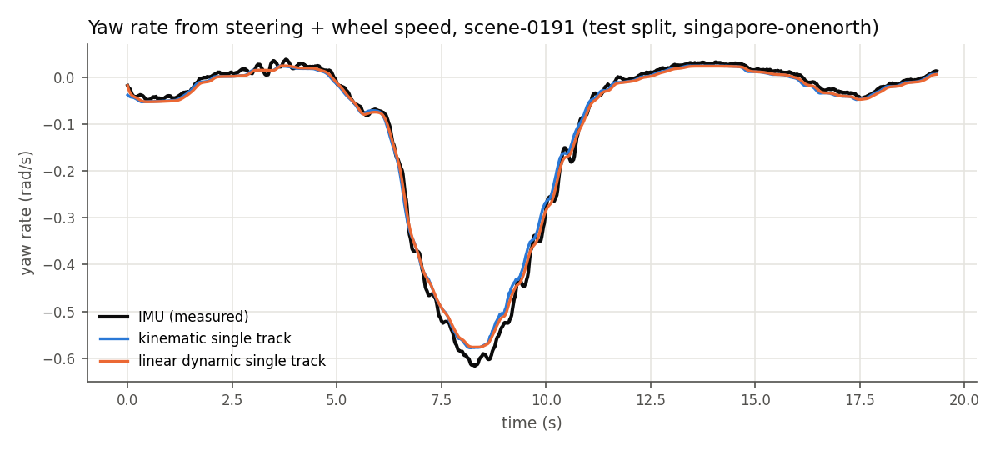
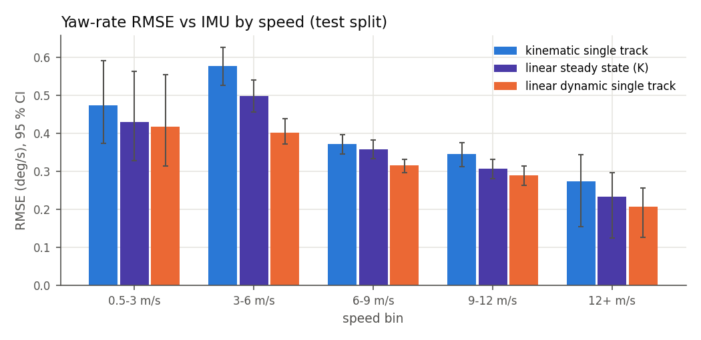
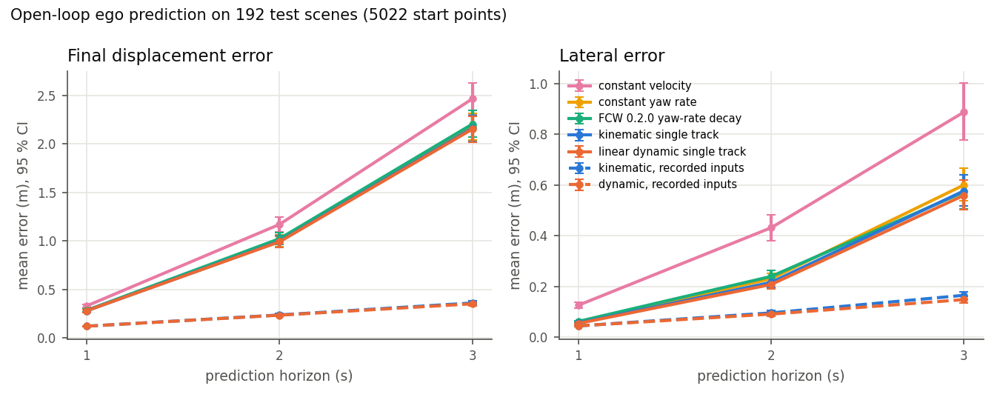

# Vehicle dynamics: models, identification, validation

Generated by `scripts/reproduce_vdyn.py` on 2026-10-07 at commit `43052977dcd3`. Do not edit by hand.
Host: AMD EPYC 7R13 Processor, 16 logical CPUs. Data: nuScenes CAN bus expansion (CC BY-NC-SA 4.0), 979 scenes with valid CAN data, two Renault Zoe cars (n008 Boston, n015 Singapore).

## Data and split

- Scenes in `can_bus.zip`: 979 kept by `tools/vdyn/can_extract.py`; none of the 21 scenes on the devkit's CAN blacklist is in the zip, and none failed the gap check (all four 50/100 Hz messages overlap for at least 10 s, no gap above 0.25 s). Messages used: `steeranglefeedback` (steering wheel), `zoe_veh_info` (rear wheel speeds), `ms_imu` (yaw rate), `pose` (position, heading, reference speed), `vehicle_monitor` (gear: only samples in drive are scored).
- Split (`configs/vdyn/split.json`, seed 20261007): train 604, val 183, test 192 scenes. Logs are kept whole (no drive is split across parts) and the split is stratified by car. Parameters are fitted on train only; val chose two settings (CG position, corridor steering variant); every number below is on test unless it says otherwise.
- Test set: 192 scenes, 1.04 h of driving, 183 with samples above 0.5 m/s.

## Identified parameters (train split)

| parameter | value | how |
|---|---|---|
| wheelbase L | 2.588 m | Renault Zoe, public spec (Wikipedia: 2,588 mm) |
| wheel radius | 0.3016 m | least squares, pose speed vs rear wheel rpm (speed RMSE 0.068 m/s on train) |
| steering ratio, kinematic | 15.68 | Gauss-Newton on r = v tan((sw - off)/i)/L |
| steering ratio, linear | 14.55 | least squares with K, r = v (sw - off) / (i L (1 + K v^2)) |
| steering-wheel offset | n008 -0.10 deg, n015 +1.11 deg | one per car (sensor calibration), fitted jointly |
| understeer gradient K | 0.00195 s^2/m^2 = 2.83 deg/g | grid search + least squares, quasi-steady samples |
| mass m | 1650 kg | assumed: kerb 1,468 kg (Wikipedia) + sensor rig + 2 people |
| CG to front axle lf | 1.165 m (0.45 L) | assumed prior; val could not separate 0.40/0.45/0.50 L (within 0.1 %) |
| yaw inertia Iz | 2735 kg m^2 | assumed m lf lr |
| cornering stiffness Cf / Cr | 80.8 / 120.0 kN/rad (per axle) | Cr by grid search on the simulated yaw rate (train), Cf from K |

Quasi-steady samples for the steady-state fits: 319749 of 586324 train samples (speed >= 3 m/s, steering-wheel rate < 0.3 rad/s, yaw acceleration < 0.1 rad/s^2, drive gear). Fit RMSE on them: kinematic 0.314 deg/s, linear with K 0.282 deg/s (one shared offset instead of one per car: 0.301 deg/s). Per-car fits (diagnostic only): n008: ratio 14.356, K 0.002694; n015: ratio 14.534, K 0.00181. All parameters live in `configs/vdyn/renault_zoe.json`, written by `tools/vdyn/identify.py` and read by the C++ library.

## 1. Yaw rate from steering angle and wheel speed vs the IMU (test split)

RMSE in deg/s, 95 % bootstrap CI over scenes (2,000 resamples). `kinematic`: v tan(delta)/L. `linear steady state`: v delta / (L (1 + K v^2)). `dynamic`: the linear single-track model simulated through the whole scene (RK4, 50 Hz) from the recorded steering and wheel speed, started once from the measured yaw rate.

| model | 0.5-3 m/s | 3-6 m/s | 6-9 m/s | 9-12 m/s | 12+ m/s | all |
|---|---|---|---|---|---|---|
| kinematic single track | 0.474 [0.373, 0.592] | 0.577 [0.526, 0.627] | 0.371 [0.346, 0.396] | 0.345 [0.313, 0.375] | 0.273 [0.154, 0.344] | 0.458 [0.428, 0.490] |
| linear steady state (K) | 0.430 [0.329, 0.564] | 0.498 [0.456, 0.541] | 0.358 [0.333, 0.383] | 0.306 [0.280, 0.331] | 0.233 [0.124, 0.296] | 0.411 [0.384, 0.443] |
| linear dynamic single track | 0.417 [0.313, 0.555] | 0.403 [0.371, 0.439] | 0.315 [0.296, 0.332] | 0.290 [0.264, 0.314] | 0.207 [0.125, 0.257] | 0.357 [0.332, 0.389] |
| samples | 23075 | 50838 | 59233 | 25527 | 204 | 158877 |

- Dynamic vs kinematic (RMSE, deg/s): -0.101 [-0.115, -0.086] (-22.0 %), lower in 173/183 scenes, CI excludes 0: yes
- Dynamic vs linear steady state: -0.054 [-0.063, -0.045] (-13.1 %), lower in 172/183 scenes, CI excludes 0: yes
- Linear steady state vs kinematic: -0.047 [-0.057, -0.037] (-10.2 %), lower in 135/183 scenes, CI excludes 0: yes
- Mean absolute error, all speeds: kinematic 0.313 [0.296, 0.329], dynamic 0.255 [0.243, 0.267] deg/s.





## 2. Open-loop ego trajectory prediction (test split)

Start points every 0.5 s where the car is in drive at >= 2 m/s and the whole horizon is recorded: 5022 per horizon. Each model starts from the recorded pose and predicts 1, 2 and 3 s ahead; the error is measured against the recorded pose (`pose`, 50 Hz). **Held** models get only what a function has at run time: steering angle, wheel speed and IMU yaw rate at the start instant, held constant. The **recorded-input** rows feed the recorded future steering and speed instead, which isolates the model error from the input prediction error; they are not a forecast. Mean error in m with 95 % CI.

| model | FDE 1 s | FDE 2 s | FDE 3 s | lateral 1 s | lateral 2 s | lateral 3 s |
|---|---|---|---|---|---|---|
| constant velocity (held) | 0.33 [0.31, 0.35] | 1.17 [1.10, 1.24] | 2.47 [2.30, 2.63] | 0.13 [0.11, 0.14] | 0.43 [0.38, 0.48] | 0.89 [0.78, 1.00] |
| constant yaw rate (held) | 0.28 [0.27, 0.30] | 1.00 [0.94, 1.06] | 2.18 [2.04, 2.31] | 0.06 [0.06, 0.06] | 0.23 [0.21, 0.25] | 0.60 [0.54, 0.67] |
| FCW 0.2.0 yaw-rate decay (held) | 0.28 [0.27, 0.30] | 1.02 [0.96, 1.08] | 2.21 [2.07, 2.34] | 0.06 [0.06, 0.07] | 0.24 [0.22, 0.26] | 0.57 [0.51, 0.64] |
| kinematic single track (held) | 0.28 [0.26, 0.29] | 0.99 [0.93, 1.05] | 2.16 [2.03, 2.30] | 0.06 [0.05, 0.06] | 0.22 [0.20, 0.24] | 0.58 [0.52, 0.64] |
| linear dynamic single track (held) | 0.28 [0.26, 0.29] | 0.99 [0.93, 1.05] | 2.15 [2.02, 2.29] | 0.05 [0.05, 0.06] | 0.21 [0.19, 0.23] | 0.56 [0.50, 0.62] |
| kinematic, recorded inputs | 0.12 [0.11, 0.13] | 0.24 [0.22, 0.25] | 0.36 [0.34, 0.38] | 0.04 [0.04, 0.05] | 0.10 [0.09, 0.10] | 0.17 [0.15, 0.18] |
| dynamic, recorded inputs | 0.12 [0.11, 0.13] | 0.23 [0.22, 0.25] | 0.35 [0.33, 0.37] | 0.04 [0.04, 0.05] | 0.09 [0.08, 0.10] | 0.15 [0.14, 0.16] |

Paired comparisons (A minus B, mean error in m, same scenes and resamples; negative = A better):

- linear dynamic single track vs kinematic single track, FDE at 1 s: -0.000 [-0.001, +0.000] (-0.1 %), lower in 105/178 scenes, CI excludes 0: no
- linear dynamic single track vs kinematic single track, lateral at 1 s: -0.001 [-0.002, -0.000] (-2.5 %), lower in 108/178 scenes, CI excludes 0: yes
- linear dynamic single track vs kinematic single track, FDE at 3 s: -0.010 [-0.013, -0.007] (-0.5 %), lower in 129/178 scenes, CI excludes 0: yes
- linear dynamic single track vs kinematic single track, lateral at 3 s: -0.018 [-0.023, -0.012] (-3.0 %), lower in 122/178 scenes, CI excludes 0: yes
- kinematic single track vs constant yaw rate, FDE at 1 s: -0.002 [-0.002, -0.001] (-0.6 %), lower in 119/178 scenes, CI excludes 0: yes
- kinematic single track vs constant yaw rate, lateral at 1 s: -0.004 [-0.006, -0.003] (-7.3 %), lower in 123/178 scenes, CI excludes 0: yes
- kinematic single track vs constant yaw rate, FDE at 3 s: -0.016 [-0.022, -0.010] (-0.7 %), lower in 127/178 scenes, CI excludes 0: yes
- kinematic single track vs constant yaw rate, lateral at 3 s: -0.023 [-0.032, -0.013] (-3.9 %), lower in 125/178 scenes, CI excludes 0: yes
- linear dynamic single track vs FCW 0.2.0 yaw-rate decay, FDE at 1 s: -0.005 [-0.006, -0.004] (-1.8 %), lower in 125/178 scenes, CI excludes 0: yes
- linear dynamic single track vs FCW 0.2.0 yaw-rate decay, lateral at 1 s: -0.008 [-0.010, -0.006] (-12.7 %), lower in 125/178 scenes, CI excludes 0: yes
- linear dynamic single track vs FCW 0.2.0 yaw-rate decay, FDE at 3 s: -0.052 [-0.079, -0.028] (-2.4 %), lower in 91/178 scenes, CI excludes 0: yes
- linear dynamic single track vs FCW 0.2.0 yaw-rate decay, lateral at 3 s: -0.013 [-0.047, +0.019] (-2.2 %), lower in 82/178 scenes, CI excludes 0: no
- FCW 0.2.0 yaw-rate decay vs constant yaw rate, FDE at 1 s: +0.003 [+0.002, +0.005] (+1.1 %), lower in 84/178 scenes, CI excludes 0: yes
- FCW 0.2.0 yaw-rate decay vs constant yaw rate, lateral at 1 s: +0.002 [-0.000, +0.005] (+3.6 %), lower in 96/178 scenes, CI excludes 0: no
- FCW 0.2.0 yaw-rate decay vs constant yaw rate, FDE at 3 s: +0.026 [+0.003, +0.052] (+1.2 %), lower in 107/178 scenes, CI excludes 0: yes
- FCW 0.2.0 yaw-rate decay vs constant yaw rate, lateral at 3 s: -0.028 [-0.061, +0.007] (-4.6 %), lower in 123/178 scenes, CI excludes 0: no
- dynamic, recorded inputs vs kinematic, recorded inputs, FDE at 1 s: -0.000 [-0.001, +0.001] (-0.1 %), lower in 86/178 scenes, CI excludes 0: no
- dynamic, recorded inputs vs kinematic, recorded inputs, lateral at 1 s: +0.000 [-0.001, +0.001] (+0.3 %), lower in 83/178 scenes, CI excludes 0: no
- dynamic, recorded inputs vs kinematic, recorded inputs, FDE at 3 s: -0.009 [-0.013, -0.005] (-2.5 %), lower in 115/178 scenes, CI excludes 0: yes
- dynamic, recorded inputs vs kinematic, recorded inputs, lateral at 3 s: -0.017 [-0.023, -0.011] (-10.2 %), lower in 121/178 scenes, CI excludes 0: yes



By car (test split; yaw RMSE in deg/s, lateral error at 3 s in m):

| car | city | scenes | yaw kinematic | yaw steady state | yaw dynamic | lat 3 s kinematic | lat 3 s dynamic |
|---|---|---|---|---|---|---|---|
| n008 | boston | 106 | 0.42 [0.39, 0.45] | 0.38 [0.36, 0.40] | 0.33 [0.31, 0.35] | 0.51 [0.45, 0.58] | 0.50 [0.43, 0.56] |
| n015 | singapore | 86 | 0.49 [0.44, 0.55] | 0.44 [0.39, 0.49] | 0.38 [0.33, 0.44] | 0.65 [0.55, 0.75] | 0.63 [0.53, 0.72] |

## 3. Corridor centre line vs the driven path

Lateral offset of the predicted path at 10, 20 and 30 m ahead, against where the car really was when it got there (start-frame coordinates, same start points; distances not reached within 6 s are skipped). This is the question the FCW corridor asks. `FCW 0.2.0 yaw-rate decay` is the exact formula of the stack (yaw rate decaying with 1 s, curvature clamp); the dynamic rows use `PredictedPath`, the code the FCW runs with `path_model = 1`. Mean absolute error in m with 95 % CI, test split.

| model | 10 m | 20 m | 30 m |
|---|---|---|---|
| constant velocity | 0.56 [0.47, 0.66] | 1.28 [1.08, 1.49] | 1.48 [1.23, 1.76] |
| constant yaw rate | 0.42 [0.33, 0.52] | 2.27 [1.76, 2.80] | 3.46 [2.63, 4.37] |
| FCW 0.2.0 yaw-rate decay | 0.34 [0.29, 0.41] | 0.84 [0.71, 0.99] | 1.00 [0.83, 1.19] |
| kinematic single track | 0.36 [0.29, 0.45] | 2.05 [1.60, 2.53] | 3.18 [2.44, 4.01] |
| dynamic, steering held | 0.37 [0.29, 0.46] | 2.12 [1.64, 2.62] | 3.22 [2.46, 4.08] |
| dynamic, steering decays (1 s) | 0.33 [0.27, 0.39] | 0.81 [0.68, 0.95] | 0.96 [0.80, 1.14] |
| start points | 4814 | 4136 | 3211 |

Validation split (mean absolute error, m), used to choose the steering variant of `path_model = 1` before the test run: FCW 0.2.0 yaw-rate decay 0.268, 0.759, 1.004; dynamic, steering held 0.289, 1.558, 2.568; dynamic, steering decays (1 s) 0.259, 0.737, 0.978.

- steering decays vs FCW 0.2.0 decay at 10 m: -0.013 [-0.016, -0.011] (-3.9 %), lower in 145/175 scenes, CI excludes 0: yes
- steering decays vs FCW 0.2.0 decay at 20 m: -0.033 [-0.039, -0.027] (-3.9 %), lower in 136/165 scenes, CI excludes 0: yes
- steering decays vs FCW 0.2.0 decay at 30 m: -0.038 [-0.047, -0.028] (-3.8 %), lower in 109/148 scenes, CI excludes 0: yes
- steering held vs FCW 0.2.0 decay at 10 m: +0.025 [-0.021, +0.074] (+7.3 %), lower in 99/175 scenes, CI excludes 0: no
- steering held vs FCW 0.2.0 decay at 20 m: +1.275 [+0.874, +1.697] (+151.5 %), lower in 57/165 scenes, CI excludes 0: yes
- steering held vs FCW 0.2.0 decay at 30 m: +2.228 [+1.550, +2.984] (+223.7 %), lower in 39/148 scenes, CI excludes 0: yes

The 10 replay-suite drives (nuScenes mini; in the CAN split they fall into train 8, val 1, test 1), same metric:

| model | 10 m | 20 m | 30 m |
|---|---|---|---|
| constant velocity | 0.85 [0.23, 1.56] | 1.41 [0.55, 2.70] | 1.10 [0.61, 1.76] |
| FCW 0.2.0 yaw-rate decay | 0.54 [0.12, 1.01] | 0.83 [0.33, 1.61] | 0.67 [0.42, 1.09] |
| dynamic, steering held | 0.72 [0.11, 1.51] | 3.98 [0.65, 8.61] | 4.85 [0.84, 9.75] |
| dynamic, steering decays (1 s) | 0.52 [0.11, 0.98] | 0.81 [0.32, 1.57] | 0.65 [0.42, 1.09] |
| start points | 231 | 187 | 156 |

## 4. FCW with the single-track corridor (opt-in `path_model = 1`)

The suite replayed on the CAN recording set (`data/recordings_can`, the published recordings plus a `/vehicle/can` topic; `recordings/catalog_can.json`) with the option OFF (default) and ON (`path_model=1`, `vehicle_model=configs/vdyn/renault_zoe.json`, `vehicle_id` per car). Drop `v0.3.0-unstamped`.

| recording | OFF identical to published | single-track cycles | warnings OFF / ON | first warning OFF / ON (s) | false OFF / ON | missed OFF / ON | golden diffs ON | state digest changed |
|---|---|---|---|---|---|---|---|---|
| scene-0061 | yes | 247/247 | 0 / 0 | - / - | 0 / 0 | 0 / 0 | 0 | yes |
| scene-0103 | yes | 265/266 | 0 / 0 | - / - | 0 / 0 | 0 / 0 | 0 | yes |
| scene-0553 | yes | 272/272 | 0 / 0 | - / - | 0 / 0 | 0 / 0 | 0 | no |
| scene-0655 | yes | 269/269 | 0 / 0 | - / - | 0 / 0 | 0 / 0 | 0 | yes |
| scene-0757 | yes | 271/271 | 0 / 0 | - / - | 0 / 0 | 0 / 0 | 0 | yes |
| scene-0796 | yes | 258/258 | 0 / 0 | - / - | 0 / 0 | 0 / 0 | 0 | yes |
| scene-0916 | yes | 265/265 | 0 / 0 | - / - | 0 / 0 | 0 / 0 | 0 | yes |
| scene-1077 | yes | 266/266 | 0 / 0 | - / - | 0 / 0 | 0 / 0 | 0 | yes |
| scene-1094 | yes | 259/259 | 0 / 0 | - / - | 0 / 0 | 0 / 0 | 0 | yes |
| scene-1100 | yes | 257/257 | 0 / 0 | - / - | 0 / 0 | 0 / 0 | 0 | no |
| scene-0796-stopped-car | yes | 258/258 | 1 / 1 | 9.84 / 9.84 | 0 / 0 | 0 / 0 | 0 | yes |
| scene-1077-stopped-car | yes | 266/266 | 1 / 1 | 11.93 / 11.93 | 0 / 0 | 0 / 0 | 0 | yes |
| scene-0655-braking-lead | yes | 269/269 | 1 / 1 | 9.96 / 9.96 | 0 / 0 | 0 / 0 | 0 | yes |

| bug | recording | window (s) | expectation | holds OFF | holds ON | note |
|---|---|---|---|---|---|---|
| BUG-0001 | scene-0103 | 0.0-3.0 | no_false_warning | True | True |  |
| BUG-0002 | scene-0061 | 6.5-8.0 | no_false_warning | True | True |  |
| BUG-0003 | scene-0916 | 8.5-11.0 | no_false_warning | True | True | scene-1094 false warnings OFF 0 / ON 0 |

- Recordings whose warnings changed with the option ON: none. The single-track corridor was used in 3422 of 3423 radar cycles (the rest had no steering message within 0.1 s), and the internal state (threat selection, TTC) changed in 11 of 13 recordings, but no warning onset moved.
- With the option OFF the extra topic changes nothing: every CAN recording gives the event and state digests of the published recording.
- What this does and does not show: on these 13 recordings the steering-based corridor neither adds nor removes a warning, keeps all three bug expectations and catches the three injected threats at the same time. The suite has no case where the two corridors disagree about a threat, so it cannot show a safety benefit; the corridor accuracy of section 3 is the measured difference. The option stays OFF by default.

## Cross-check in GNU Octave

`tools/vdyn/octave/steady_state.m` (GNU Octave 11.1.0, alpine:3.24.2 container) builds the state-space matrices of the linear single-track model from `configs/vdyn/renault_zoe.json` and solves the steady state with Octave's linear solver for 36 speed/steering cases (2-30 m/s). Largest relative difference to the C++ RK4 simulation (30 s): 3.3e-13; to the C++ closed form: 3.3e-13. This checks the implementation of the equations, not the model: both sides use the same parameters. Octave only; no MATLAB or Simulink was used.

## 5. Reprocessing throughput and determinism (all scenes)

`tools/vdyn/pipeline.py` over all 979 scenes (5.31 h of driving): scenes grouped by car, 8 per `vdyn_eval` process, a thread pool keeps N processes running. Wall time includes process start and CSV parsing.

| workers | processes | scenes | wall s | scenes/s | x real time | batch digest |
|---|---|---|---|---|---|---|
| 1 | 123 | 979 | 6.20 | 158.0 | 3083 | 85f8fb62f6fcf447 |
| 2 | 123 | 979 | 3.12 | 314.1 | 6129 | 85f8fb62f6fcf447 |
| 4 | 123 | 979 | 1.61 | 609.6 | 11894 | 85f8fb62f6fcf447 |
| 8 | 123 | 979 | 0.99 | 985.0 | 19221 | 85f8fb62f6fcf447 |
| 16 | 123 | 979 | 0.79 | 1234.9 | 24097 | 85f8fb62f6fcf447 |

- Distinct batch digests over all worker counts plus a repeat run: 1 (identical). Every scene digest is computed by the C++ side from the metrics alone, so chunking and scheduling cannot change it.

## Assumptions and limits

- One vehicle type (Renault Zoe), two cars, urban Boston and Singapore driving: speeds mostly below 15 m/s and lateral acceleration far below the tyre limit (only 204 test samples above 12 m/s, so that bin is thin). Nothing here says how the models do on a highway or near the limit.
- Linear tyres: no saturation, no combined slip, no load transfer, roll or pitch; constant mass and assumed CG and inertia. lf and Iz are not identifiable from these data (validation error within 0.1 % for 0.40-0.50 L).
- Open loop: held models keep the start-instant steering and speed; nobody predicts the driver. The displacement error at 2-3 s is dominated by the speed assumption, the lateral error by the path model.
- CAN timing: `zoe_veh_info` carries reception time, not measurement time (devkit note); signals are linearly interpolated onto the 50 Hz pose clock. No latency between steering and yaw is modelled beyond the dynamics.
- The IMU yaw rate is the reference for section 1 and the pose for sections 2-3; both are the vehicle's own estimates, not survey-grade ground truth.
- The FCW experiment covers 13 recordings (10 real mini drives, 3 injected must-warn cases). It shows no change, not an improvement.

## Reproduce

```bash
curl -O https://motional-nuscenes.s3.amazonaws.com/public/v1.0/can_bus.zip   # 781 MB, no login
mkdir -p meta; for v in trainval test; do   # scene and log tables only (logs, cars, cities for the split)
  curl -sSfL https://motional-nuscenes.s3.amazonaws.com/public/v1.0/v1.0-${v}_meta.tgz \
    | tar -xz -C meta --wildcards "v1.0-$v/scene.json" "v1.0-$v/log.json"; done
python tools/vdyn/can_extract.py --can-zip can_bus.zip --meta meta --out ~/workspace/drive-replay-data/can_scenes
bazel build -c opt //stack/vdyn:vdyn_eval && python tools/vdyn/identify.py --scenes ~/workspace/drive-replay-data/can_scenes
python tools/vdyn/add_can_topic.py --can-zip can_bus.zip   # CAN recording set for section 4
python scripts/reproduce_vdyn.py
```
